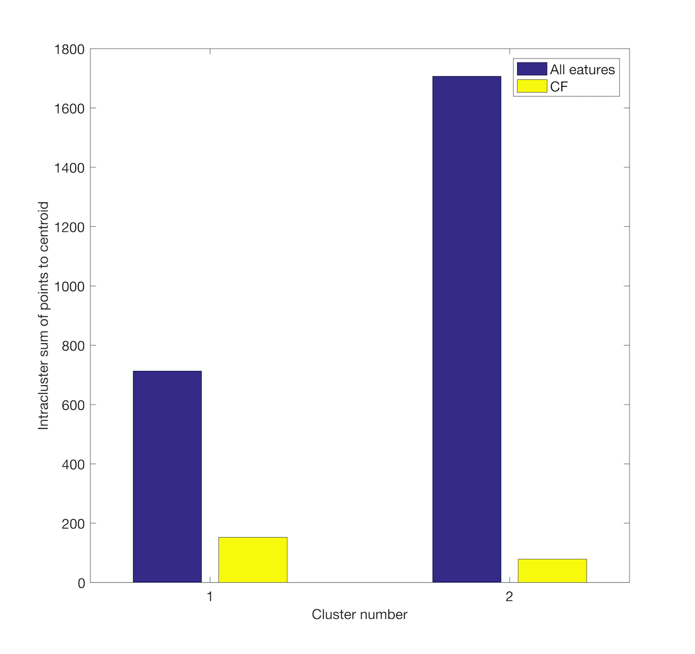

## Cluster-ensemble

A subset *f* of the given feature space *F* is selected by cluster ensembling aporoach.
The growth of subset is defined by quality factor *kf* as the ratio of within cluster and between cluster sum of squared distance.
*kf(f)=SSW(f)/SSB(f)*

Feature competition provides a way to good initialization for the growth of a clustering vector(usual mode q = 1).
It is a modified version of the process described in the publication Cluster Forests[1].

The example code illustrates the use of cluster forest concept. The [uci ionosphere](https://archive.ics.uci.edu/ml/datasets/ionosphere) dataset has been used.

The resultant feature subset elucidates lower intracluster distance of samples.

## Dependencies
* Matlab/Octave

## Reference
[1]. Yan, Donghui, Aiyou Chen, and Michael I. Jordan. "Cluster forests." Computational Statistics & Data Analysis 66 (2013): 178-192.